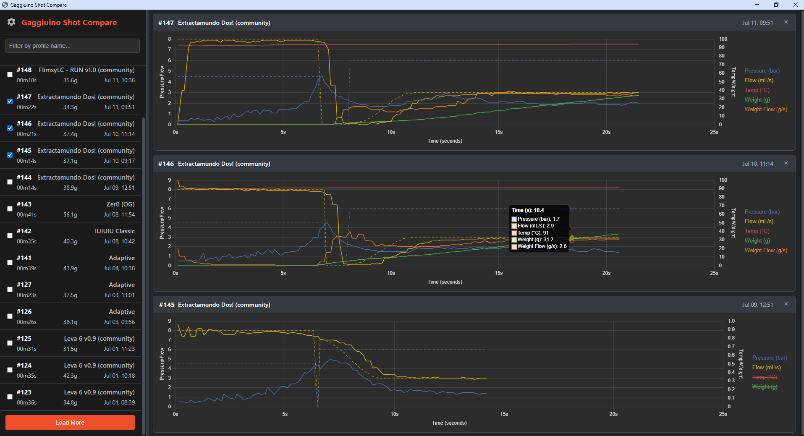

# Gaggiuino Shot Compare


[](https://github.com/threethirtyam/gaggiuino-shot-compare/releases)

A simple, local desktop application for viewing and comparing espresso shots from a Gaggiuino-modified espresso machine.



## About The Project

This application provides a straightforward way to review your espresso shot data without relying on external web services. It connects directly to your Gaggiuino over your local network, fetches recent shots, and displays them on interactive charts for easy side-by-side comparison.

This was built for personal use, but is shared here in case it's useful to others in the [Gaggiuino community](https://gaggiuino.github.io/).


## Key Features

-  📈 **Compare Multiple Shots:** Display shots side-by-side to analyse consistency and the impact of different profiles.
-  ⭐ **Save Your Favourites:** Star your 'god shots' and quickly access them in a dedicated view, making them easy to find and select for reference comparisons.
-  📊 **Interactive Charts:** Plots pressure, flow, temperature, and weight with a synchronized time axis. Toggle data series on/off by clicking the legend.
-  🔍 **Filter & Find:** Quickly find specific shots by filtering the list by profile name.
-  🎨 **App Customisation:** Set your Gaggiuino's address, configure the maximum number of charts, and switch between light and dark themes.
-  🔄 **Live Data & Fast UI:** The 'Recents' button instantly pulls in new shots made while the app is running. The shot list also now pre-fetches in the background for a smooth, responsive feel.
-  💻 **Easy for Everyone:** Includes a simple executable for Windows users, no installation or command line needed!
-  🌐 **100% Local:** Runs entirely on your computer and local network. No cloud services or internet connection required.

## Tech Stack

-	**Backend:** Python with [Eel](https://github.com/python-eel/Eel)
-	**Frontend:** HTML, CSS, JavaScript
-	**Charting:** [Chart.js](https://www.chartjs.org/)

## Installation & Usage

There are two ways to run this application.

### The Easy Way (for Windows Users)

This is the recommended method for most users on Windows. No installation, no technical setup!

1.  Go to the [**Releases Page**](https://github.com/threethirtyam/gaggiuino-shot-compare/releases).
2.  Download the latest `.exe` file (e.g., `Shot Compare.exe`).
3.  Double-click the downloaded file to run it. That's it!

---

### From Source (for Developers, macOS, and Linux Users)

This method is for users who are comfortable with the command line or are not on Windows.

**Prerequisites:**
-	[Python 3.6+](https://www.python.org/downloads/) installed.
-	[Git](https://git-scm.com/downloads) installed.

**Instructions:**
1.  **Clone the repository:**
    ```bash
    git clone https://github.com/threethirtyam/gaggiuino-shot-compare.git
    cd gaggiuino-shot-compare
    ```

2.  **Install the required Python packages:**
    ```bash
    pip install -r requirements.txt
    ```

3.  **Run the application:**
    ```bash
    python main.py
    ```

## Troubleshooting

   **Connection Error / No Shots Found:**
		Ensure your Gaggiuino is powered on and successfully connected to the same WiFi network as your computer.
		Try navigating to `http://gaggiuino.local` in your web browser. If your machine uses something other than the Gaggiuino default URL, you need to update the app settings.
		The app can only display shots that have already been saved on the machine's SD card.

## Known Issues

-   **WINDOWS - App cannot survive sleep/wake cycle:** App will fail if left idle during Windows sleep/wake cycle.
    -   **Reason:** Windows kills WebSockets at sleep and the current app architecture cannot recover.
    -   **Solution:** No solution exists (AFAIK) to recover automatically from this. An overlay is in place which instructs, please restart app. 🤷

-   **ALL - Slow loading or loading stops with deleted shots:** The app may appear to hang when loading shots if a large number of consecutive shots have been deleted from the history on the Gaggiuino's SD card (like PZ calibration 'shots'). If a block of more than 25 consecutive shots has been deleted the app will stop loading new shots.
    -   **Reason:** The app searches for shots sequentially by their ID number. When it encounters a large gap of missing IDs, it must try to fetch each one individually before finding the next available shot, this takes time.
    -   **Solution:** This is expected behaviour - you may not even notice. For best performance, it's recommended to avoid deleting large contiguous blocks of shots from your history. The number of consecutive shots (default 25) that determine when the app gives up searching for new shots is configurable at build.

## Project Philosophy

This project started from a simple need: I wanted to compare my espresso shots side-by-side, locally, and couldn't find a readymade solution.

So, I made this. Well truthfully, I wrote some requirements and chat made it, and after quite some iterations I got what I wanted.

I use this app every day to analyse my shots and learn more about profiling with Gaggiuino. I have built out functionality that makes this task easy for me.

Testing: I made this for me. It is robust in my environment. It's a simple app, but YMMV!

I'm open to suggestions for improvements - find me on the Gaggiuino Discord.