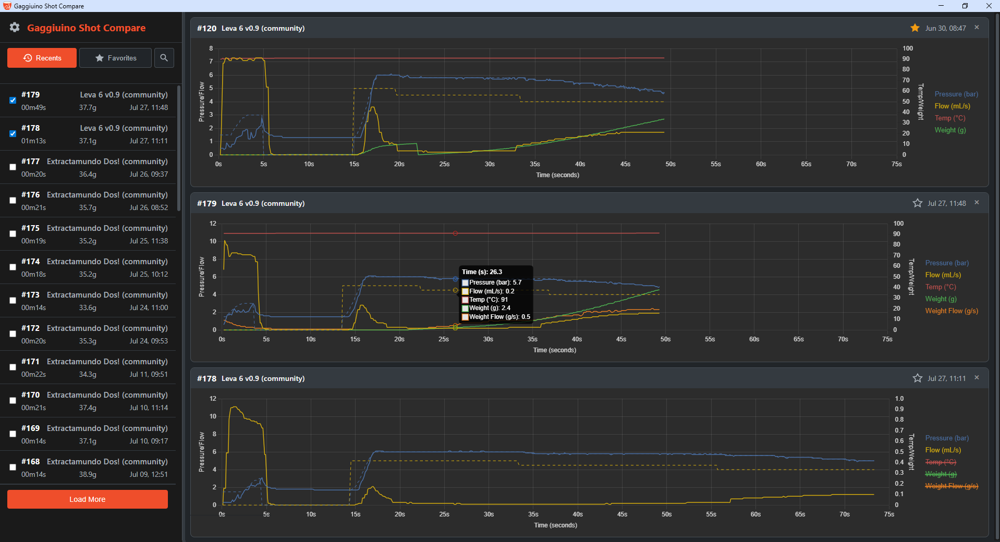

# Gaggiuino Shot Compare


[](https://github.com/threethirtyam/gaggiuino-shot-compare/releases)

A simple, local desktop application for viewing and comparing espresso shots from a Gaggiuino-modified espresso machine.



## About The Project

This application provides a straightforward way to review your espresso shot data without relying on external web services. It connects directly to your Gaggiuino over your local network, fetches recent shots, and displays them on interactive charts for easy side-by-side comparison.

This was built for personal use, but is shared here in case it's useful to others in the [Gaggiuino community](https://gaggiuino.github.io/).


## Key Features

📈 **Compare Multiple Shots:** Display up to 3 shots side-by-side to analyse consistency and the impact of different profiles.
📊 **Interactive Charts:** Plots all key metrics like pressure, flow, temperature, and weight. Toggle data series on/off by clicking the legend.
💻 **Easy for Everyone:** Includes a simple executable for Windows users, no command line needed!
🌐 **Local First:** Runs entirely on your computer and local network. No cloud services or internet connection required (after initial setup).
🔍 **Shot List Filter:** Quickly find shots by filtering the list by profile name.
🎨 **Light & Dark Modes:** Includes a theme toggle to switch between a light or dark interface, with your preference saved locally.

## Tech Stack

-	**Backend:** Python with [Eel](https://github.com/python-eel/Eel)
-	**Frontend:** HTML, CSS, JavaScript
-	**Charting:** [Chart.js](https://www.chartjs.org/)

## Installation & Usage

There are two ways to run this application.

### The Easy Way (for Windows Users)

This is the recommended method for most users on Windows. No technical setup required!

1.  Go to the [**Releases Page**](https://github.com/threethirtyam/gaggiuino-shot-compare/releases).
2.  Download the latest `.exe` file (e.g., `gsc_v1_0.exe`).
3.  Double-click the downloaded file to run it. That's it!

---

### From Source (for Developers, macOS, and Linux Users)

This method is for users who are comfortable with the command line or are not on Windows.

**Prerequisites:**
-	[Python 3.6+](https://www.python.org/downloads/) installed.
-	[Git](https://git-scm.com/downloads) installed.

**Instructions:**
1.  **Clone the repository:**
    ```bash
    git clone https://github.com/threethirtyam/gaggiuino-shot-compare.git
    cd gaggiuino-shot-compare
    ```

2.  **Install the required Python packages:**
    ```bash
    pip install -r requirements.txt
    ```

3.  **Run the application:**
    ```bash
    python main.py
    ```

## Troubleshooting

   **Connection Error / No Shots Found:**
		Ensure your Gaggiuino is powered on and successfully connected to the same WiFi network as your computer.
		Try navigating to `http://gaggiuino.local` in your web browser. If it doesn't load, you may need to find your machine's IP address and edit the `base_url` in `main.py` (if running from source).
		The app can only display shots that have already been pulled and saved on the machine.

## Project Philosophy

This project started from a simple need: I wanted to compare my espresso shots side-by-side, locally, and couldn't find a readymade solution.

So, I made this. Well truthfully, I wrote some requirements and chat made it. I can't take credit - I just told chat what to do and made sure my requirements were met - after quite some iterations.

I put it here in case it is also useful to someone else.
